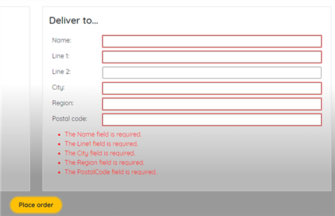
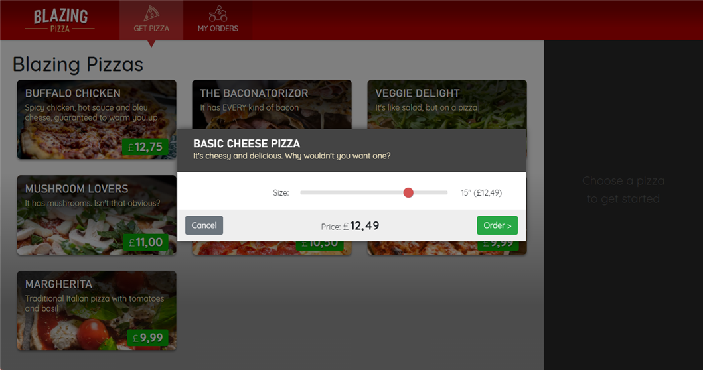
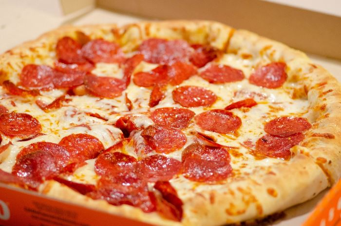
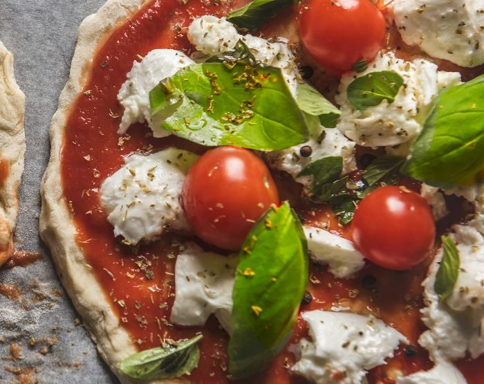
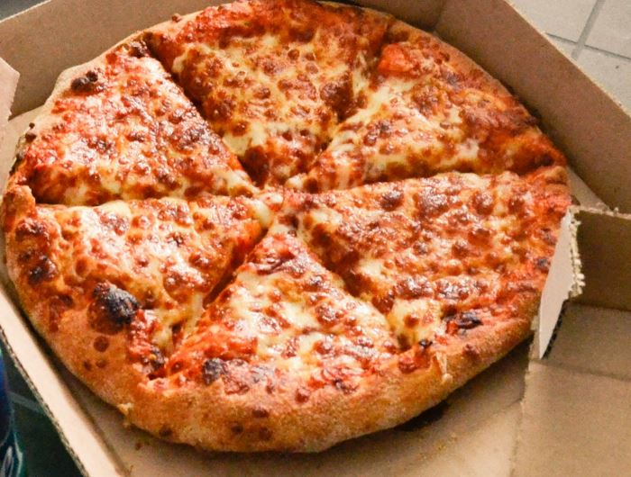
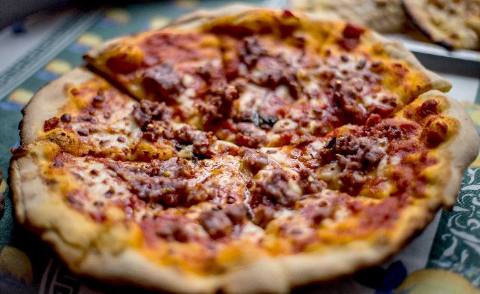
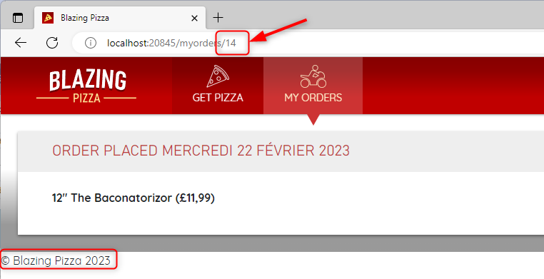

# 🍕 BlazingPizza

A Blazor sample project for building an interactive pizza ordering app! From browsing specials to tracking orders — this full-stack app is powered by modern .NET and a tasty UI.

---

## 🖼 Preview

Take a look at what BlazingPizza has to offer:

| Home Page                          | Order Review Page                   |
|-----------------------------------|-------------------------------------|
|  |  |

---

## 🍽 Pizza Gallery

Our pizza selection, served with pixels:

<p float="left">
  
  
  
  
</p>

---

## 🗂 Project Structure

Explore the major folders and files in the repo:

```
Ὄ1 BlazingPizza/
├── 📁 wwwroot/
│   ├── css/
│   ├── img/ (SVGs & Pizza Images)
├── 📁 Pages/ (UI Razor Pages)
├── 📁 Shared/ (Layout & UI Components)
├── 📁 Components/ (Custom Components)
├── 📁 Model/ (Pizza, Order, etc.)
├── 📁 Controllers/
├── 📁 Data/ (Seed Data & DB Context)
├── 📁 Services/ (Order Logic)
├── 📁 Images/ (Screenshots)
├── App.razor, Program.cs
├── BlazingPizza.sln
└── README.md
```

> 🖼 Alternatively, you can use a real tree image:
> 
> 

---

## 🤝 Contributing

This project welcomes contributions and suggestions. When submitting a pull request:

- A **CLA bot** will check if you need to sign a Contributor License Agreement.
- Just follow the steps provided by the bot.
- You only need to do this **once** across all Microsoft repos.

---

## 📜 Code of Conduct

We abide by the [Microsoft Open Source Code of Conduct](https://opensource.microsoft.com/codeofconduct/).

📧 Contact: [opencode@microsoft.com](mailto:opencode@microsoft.com)

---

## ⚖️ Licenses

- 📘 Documentation: [CC BY 4.0 License](https://creativecommons.org/licenses/by/4.0/legalcode)
- 💻 Code: [MIT License](https://opensource.org/licenses/MIT)

> 🛑 The licenses do **not** grant rights to Microsoft names, logos, or trademarks. See Microsoft’s [trademark guidelines](http://go.microsoft.com/fwlink/?LinkID=254653).

🔐 [Privacy Statement](https://privacy.microsoft.com/en-us/)

---

## 🚀 Start Coding Now!

If you love 🍕 and code, this is your playground. Clone, run, and build BlazingPizza today.

---


